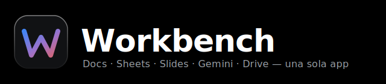
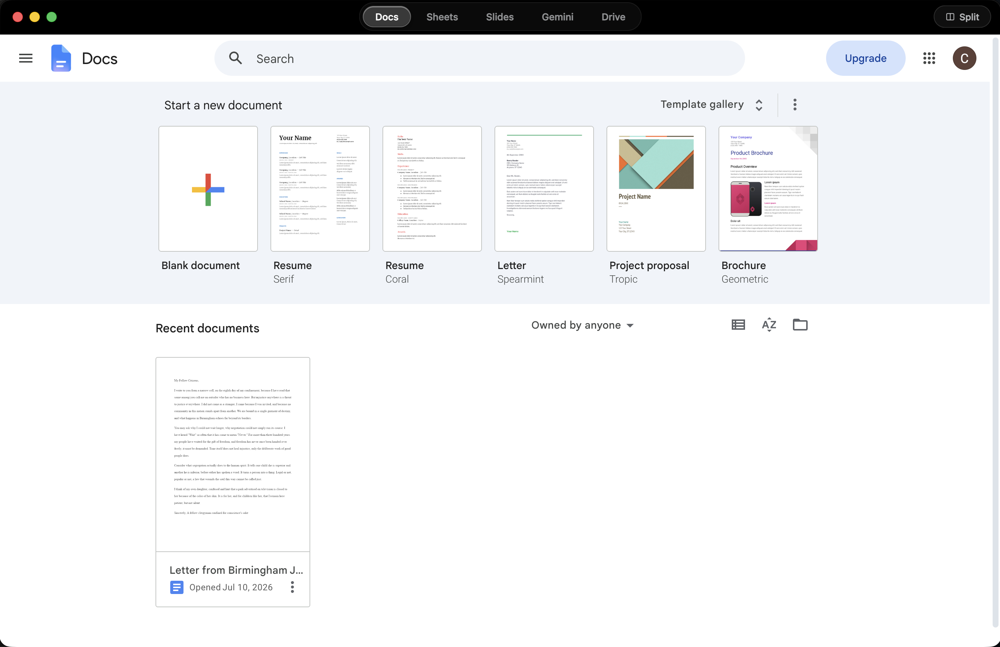
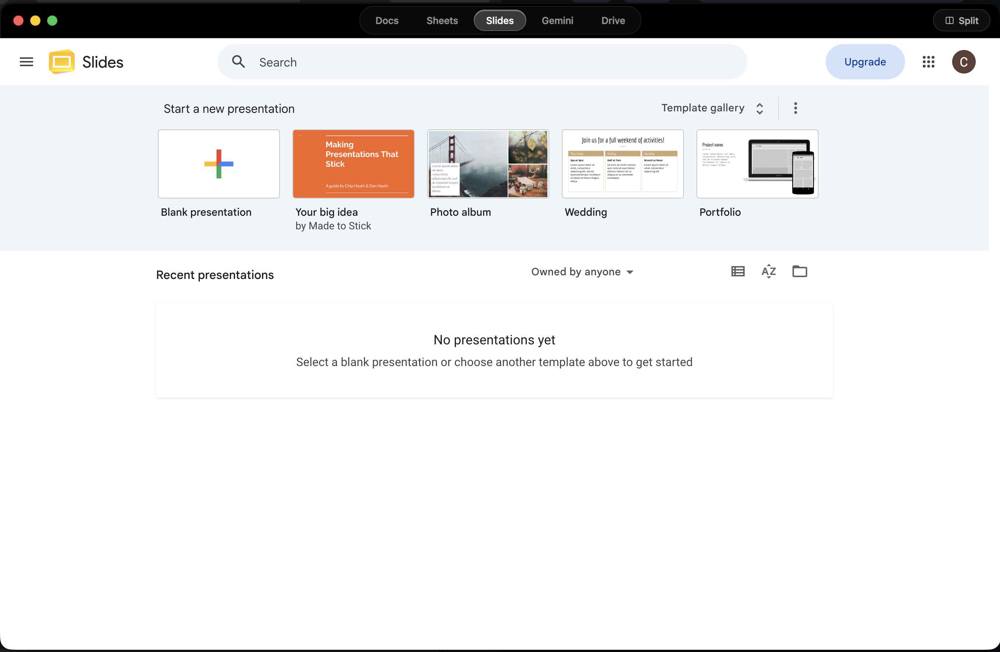
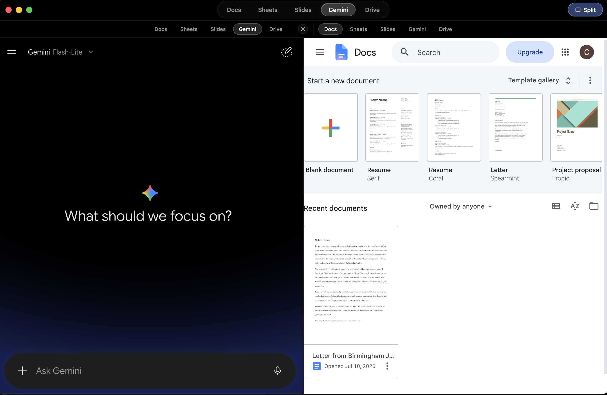

  

# Workbench

Workbench es una app de escritorio para macOS que reúne **Google Docs,
Sheets, Slides, Gemini y Drive** en una sola ventana con pestañas, en vez de
tener que manejarlos como pestañas sueltas del navegador.

## Capturas

| Docs | Slides |
|---|---|
|  |  |

| Pantalla dividida (Gemini + Docs) |
|---|
|  |

## Qué hace

- **5 apps en una sola ventana**: Docs, Sheets, Slides, Gemini y Drive, cada
  una con su propia pestaña (⌘1–⌘5 para saltar entre ellas).
- **Enrutamiento automático**: si abres un archivo desde Drive, la app
  detecta si es un documento, una hoja de cálculo o una presentación, y lo
  abre directamente en la pestaña correspondiente — nunca sales de la app.
- **Pantalla dividida**: dos paneles lado a lado, cada uno con su propio
  selector de app independiente (botón "Split" o ⌘\\).
- Guarda tu sesión de Google entre usos — no hay que iniciar sesión cada vez.

## Instalación

1. Ve a la pestaña [**Releases**](../../releases) de este repositorio y
   descarga el `.zip` más reciente (`Workbench-mac.zip`).
2. Arrastra `Workbench.app` a tu carpeta
   **Aplicaciones**.
3. Al abrirla por primera vez, macOS mostrará un aviso de que no puede
   verificar quién hizo la app. Esto es esperado — sigue estos pasos:
   - Intenta abrir la app normalmente (doble clic). Verás el aviso de
     bloqueo.
   - Ve a **Configuración del Sistema → Privacidad y Seguridad**.
   - Baja hasta la sección de Seguridad. Debería aparecer un mensaje
     mencionando que "Workbench" fue bloqueada, con un botón
     **Abrir de todos modos**.
   - Haz clic ahí y confirma con tu contraseña o Touch ID.
   - Abre la app una vez más y confirma con **Abrir** en el último diálogo.
     A partir de ahí, la app abre normalmente sin volver a preguntar.

### ¿Por qué hay que hacer esto en vez de simplemente abrir la app?

macOS solo abre "sin preguntar" las apps que pasaron por el proceso de
**notarización de Apple**, que requiere una membresía paga del
**Apple Developer Program** (99 USD al año) más un certificado de firma
propio. Workbench es un proyecto personal/pequeño, así que en lugar de pagar
esa cuota, la app se firma con una **firma "ad-hoc"** (gratuita) durante el
proceso de build automático en GitHub Actions.

Esa firma ad-hoc es suficiente para que macOS confíe en que el archivo no fue
alterado después de compilarse, pero no incluye la verificación de identidad
de un desarrollador registrado ante Apple — por eso Gatekeeper (el sistema de
seguridad de macOS) la trata como "de un desarrollador no identificado" y
pide una confirmación manual la primera vez, en vez de bloquearla
directamente como "dañada". Es un paso único por instalación, no algo que se
repita cada vez que abras la app.
